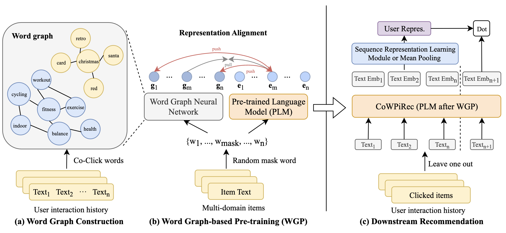

# CoWPiRec

This is the official implementation for *Collaborative Word-based Pre-trained Item Representation for Transferable Recommendation*.

<div align=center>

</div>

## Requirements

```
python==3.9.7
recbole==1.0.1
torch==1.10.0
cudatoolkit==11.3
transformers==4.21.2
```

## Quick Start

We provide the pre-trained model of CoWPiRec in ```saved/model/CoWPiRec-base``` and a preprocessed dataset of ```Scientific``` dataset in ```dataset/Scientific```. You can repreduce our experiment results following the steps below.

Git clone this repository, you should first install git-lfs (https://git-lfs.com) for downloading the pre-trained model.
```
git lfs install
git clone https://github.com/ysh-1998/CoWPiRec.git
```
Get the text-based item embedding with CoWPiRec.
```
python get_emb.py --gpu_id=0 --dataset Scientific
```
Train and evaluate on downstream datasets ```Scientific```.
```
python downstream/finetune.py --gpu_id=0 -d Scientific
```

## Pipeline

The pipeline to repreduce CoWPiRec is shown below.

### Datasets

To preprocessing datasets, you should prepare tow raw_data files: 

1. user interaction data ```data_name.csv```, format:  ```user_id,item_id,time```
2. item metadata ```meta_data_name.csv```,  format:  ```item_id,item_text``` 

Place these two files in ```./dataset/raw_data/interaction``` and ```./dataset/raw_data/metadata```, respectively, then run script below:

```
python ./dataset/preprocessing/process_dataset.py --dataset dataset_name
python ./dataset/preprocessing/tokenizer.py --dataset dataset_name
```

The dataset path generated contains: 

```
dataset/
  dataset_name/
    data_name.train.inter
    data_name.dev.inter
    data_name.test.inter
    data_name.text
    data_name.tokenize.json
    data_name.item2index
    data_name.user2index
```

### Word Graph

The word graph is a key component in pre-training of CoWPiRec and is constructed based on co-click items. Obtain the co-click item pairs first.

```
python ./WordGraph/get_coclick_item_pairs.py --dataset dataset_name
```

Process co-click item pairs to get co-click word graph.

```
python ./WordGraph/get_coclick_word_graph.py \
  --dataset dataset_name --num_workers 40 --max_len 64
```

You can perform multiprocessing by modifing the argument ```--number_workers```. The max length of item text is controlled by the argument ```--max_len```.

Process co-click word graph, filter neighbors based on tf-idf.

```
python ./WordGraph/get_word_graph.py --dataset dataset_name --topN 30
```

argument ```--topN``` denotes the number of neighbors after filtering.

### Pretraining

Pre-train on single GPU.

```
python pretrain.py --gpu_id=0 -d pretrain_dataset_name
```

Pre-train with multi GPUs.

```
CUDA_VISIBLE_DEVICES=0,1,2,3 python ddp_pretrain.py
```

### Downstream

Get item embedding using CoWPiRec.
```
python get_emb.py --gpu_id=0 --dataset dataset_name \
    --load_pretrain_model --pretrain_model_path saved/xxx.pth
```
Downstream recommendation.
```
python downstream/finetune.py --gpu_id=0 -d dataset_name
```

